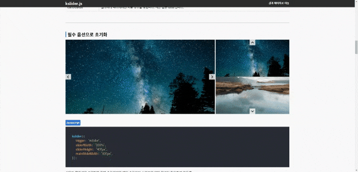

# 🎠 kslider.js

Javascript(ES6) 문법을 사용하여 제작된 이미지 슬라이드 캐러셀 입니다.
사용자 경험을 제공하며 웹 접근성을 고려하여 제작된 kslider.js는
플러그인이나 라이브러리에 의존적이지 않고 독립적으로 사용 가능하도록 제작되었습니다.

[📃Demo](https://kyoungsic-dev.github.io/kslider)
